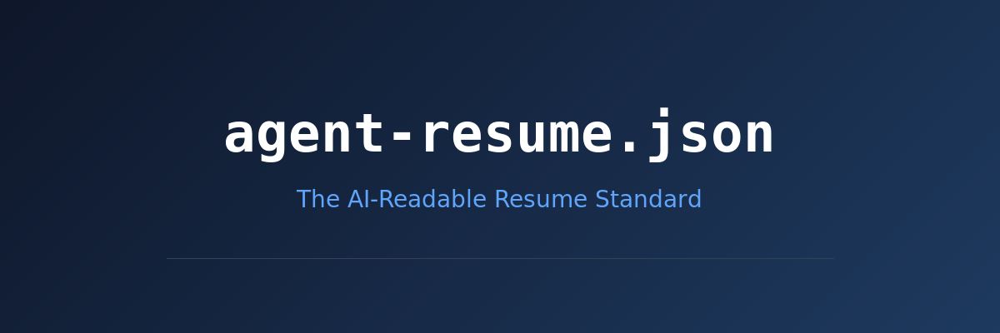

# Agent Resume Standard

**A machine-readable resume format designed for AI agents.**

Traditional resumes are built for human eyes — PDFs, Word docs, and free-form text that AI agents have to parse with NLP, losing structure and meaning along the way. The Agent Resume Standard is a JSON schema that gives AI recruiters, talent-matching bots, and screening agents exactly what they need: structured, queryable, unambiguous candidate data.

This repo contains both the **open specification** and **Daniel Rosehill's live resume** as the reference implementation.

---

## Why?

AI agents screening candidates today have to:

- Parse unstructured PDF/DOCX text and guess at field boundaries
- Infer salary expectations from job titles and location
- Guess at remote/onsite preferences from job descriptions
- Miss deal-breakers, values, and work style preferences entirely
- Ignore timezone constraints until the interview stage

The Agent Resume Standard solves this by putting all of this data in a single, validated JSON document with explicit fields for compensation, work preferences, engagement types, matching criteria, and agent-specific instructions.

---

## Quick Example

```json
{
  "meta": {
    "format": "agent-resume",
    "version": "1.0.0",
    "lastUpdated": "2026-02-17"
  },
  "person": {
    "fullName": "Daniel Rosehill",
    "headline": "AI Developer & Technical Communications Professional",
    "email": "public@danielrosehill.com"
  },
  "compensation": {
    "hourlyRate": { "min": 100, "max": 175, "currency": "USD" },
    "negotiable": true
  },
  "workPreferences": {
    "remotePreference": "remote_only",
    "asyncPreference": "async_preferred",
    "meetingTolerance": "minimal"
  },
  "matchCriteria": {
    "lookingFor": ["AI agent development", "Technical documentation"],
    "notLookingFor": ["Onsite-only positions", "Entry-level roles"],
    "keywords": ["AI agents", "LLM", "MCP", "prompt engineering"]
  },
  "agentInstructions": {
    "humanVerification": "Contact candidate before sharing info with third parties."
  }
}
```

---

## What's in This Repo

| File | Description |
|------|-------------|
| [`resume-agent.json`](resume-agent.json) | Daniel Rosehill's AI resume (reference implementation) |
| [`schema/agent-resume-schema.json`](schema/agent-resume-schema.json) | JSON Schema (draft 2020-12) — the normative spec |
| [`docs/spec.md`](docs/spec.md) | Full specification document |
| [`docs/field-reference.md`](docs/field-reference.md) | Detailed field-by-field reference |
| [`docs/adoption-guide.md`](docs/adoption-guide.md) | How to create, consume, and promote agent resumes |
| [`resume.json`](resume.json) | Traditional JSON resume (kept for comparison) |
| [`resume.md`](resume.md) | Markdown resume |

---

## Sections at a Glance

The Agent Resume Standard defines these sections:

| Section | Required | Purpose |
|---------|----------|---------|
| `meta` | Yes | Format version, update date, alternate formats |
| `person` | Yes | Name, headline, contact info, social links |
| `location` | Yes | City, country, timezone with DST details |
| `summary` | Yes | Professional summary |
| `availability` | Yes | Current status and engagement types |
| `skills` | Yes | Primary, secondary, and tool proficiencies |
| `experience` | Yes | Work history with ISO dates and tags |
| `education` | Yes | Degrees and institutions |
| `compensation` | No | Salary/rate ranges with currency |
| `experienceSummary` | No | Total years, domain breakdown, seniority |
| `workPreferences` | No | Remote, async, meeting tolerance, hours |
| `engagementPreferences` | No | Preferred types, industries, deal-breakers |
| `portfolio` | No | GitHub, Hugging Face, npm, publications |
| `languages` | No | Spoken languages with ISO 639 codes |
| `matchCriteria` | No | What you want and don't want — for agent filtering |
| `communication` | No | How and when to reach the candidate |
| `values` | No | Work culture values |
| `agentInstructions` | No | Meta-instructions for consuming AI agents |

---

## Adopting the Standard

### As a Candidate
1. Copy [`resume-agent.json`](resume-agent.json) as a template
2. Fill in the required sections
3. Add optional sections relevant to your search
4. Validate against the [schema](schema/agent-resume-schema.json)
5. Host alongside your regular resume

### As a Platform / AI Agent
1. Fetch and validate against the schema
2. Use `matchCriteria` for initial filtering
3. Use `compensation` for budget matching
4. Respect `agentInstructions.humanVerification`
5. See the full [adoption guide](docs/adoption-guide.md)

---

## Validation

Validate a resume against the schema:

```bash
# Using ajv-cli (Node.js)
npx ajv validate -s schema/agent-resume-schema.json -d resume-agent.json

# Using Python
pip install jsonschema
python -c "
import json, jsonschema
schema = json.load(open('schema/agent-resume-schema.json'))
resume = json.load(open('resume-agent.json'))
jsonschema.validate(resume, schema)
print('Valid!')
"
```

---

## License

This specification is open for adoption. Daniel Rosehill's resume data is his own.

## Author

**Daniel Rosehill** — [danielrosehill.com](https://danielrosehill.com) | [GitHub](https://github.com/danielrosehill) | [Hugging Face](https://huggingface.co/danielrosehill)
